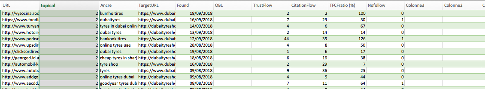
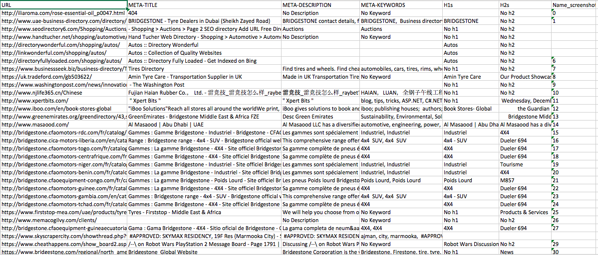

# Bulk-Metadata-Scraper
Ruby script that scrapes Header data + takes a screenshot of the page for OCR analysis

The script uses Watir, Nokogiri and MetaInspector to capture all the required data; the code is fully documented, starting from bottom to the up.

The script collects, collects from the first sheet of an excel all the URL.
Then, it will check and collect the :
- Meta-Title
- Meta-Description
- Meta-Keywords
- H1s
- H2s
- Name of the corresponding Screenshot

The screenshots will be saved in the same directory as the script and named after the corresponding number of the excel.

Headless mode is commented, but comment the normal one and uncomment the headless one -> Works perfectly !

All the data is collected and exported in a CSV

Here is an insight of the Source Xls file structure : 

Picture of the outcome CSV : 
